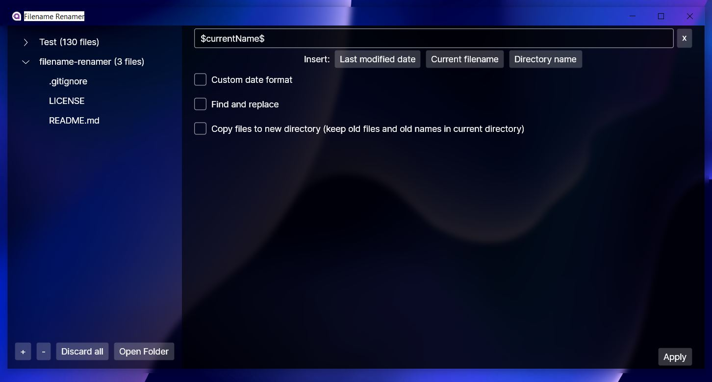

# Filename Renamer

Filename Renamer is an application created to rename files in bulk through an easy to use drag and drop interface.
It currently supports appending any new text and even some file metadata, like the last modified date.
It is written with C# and .NET, and utilizes Avalonia UI for the GUI.
